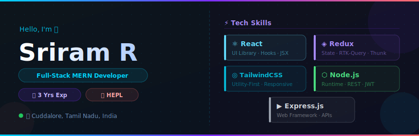

# Hi there, I'm Sriram! 👋

  

### 💫 About Me

I am a passionate **Full-Stack MERN Developer** focused on engineering high-performance web applications, interactive visual designs, and clean backend systems.

- 💼 Currently working as a **Junior Software Engineer** at **Hema's Enterprise Pvt Ltd** (HEPL)
- 📍 Based in **Cuddalore, Tamil Nadu, India**
- 🚀 Self-taught coding enthusiast with strong foundations in React.js, Redux, Node.js, Express, MongoDB, Next.js, and Socket.io.
- ⚡ Fun fact: I love building tools that solve real-world problems and creating interactive study guides for technical interviews!

---

### 🛠️ Tech Stack & Tools

<table>
  <tr>
    <td valign="top" width="50%">
      <h4>Frontend Development</h4>
      
      
      
      
      
      
      
      
    </td>
    <td valign="top" width="50%">
      <h4>Backend & Database</h4>
      
      
      
      
      <h4>Tools & Deployment</h4>
      
      
      
      
    </td>
  </tr>
</table>

---

### 📂 Featured Projects & Work

🧑‍💻 **[advanced-mern-practice](https://github.com/Sriram-Dee/advanced-mern-practice)**
*A professional, branch-based MERN stack practice repository focusing on production patterns:*
- **Backend Branch**: Secure Express API featuring JWT-based authentication (refresh and access token management via secure HTTP-only cookies), role-based middleware, and custom MongoDB schemas.
- **Frontend Branch**: React framework utilizing Redux Toolkit (RTK-Query & asyncThunk) for optimized caching and client-side state orchestration.

📖 **[interview-prep-guide](https://github.com/Sriram-Dee/interview-prep-guide)**
*A modern, dark-themed dashboard built with React and Vite for technical study:*
- Integrates study guides, progress charts, and interview trackers.
- Features a secure "Ghost Mode" protected by a password modal.

🗣️ **[tamil-shop-announcer](https://github.com/Sriram-Dee/tamil-shop-announcer)**
*React application that leverages Google Gemini AI to generate natural Tamil audio announcement scripts:*
- Integrates AI text generation and automated speech parsing.
- Sleek, mobile-first, and responsive interface.

---

### 📊 GitHub Analytics

  
  &nbsp;&nbsp;
  

---

### 🤝 Connect with Me

  
  &nbsp;
  

